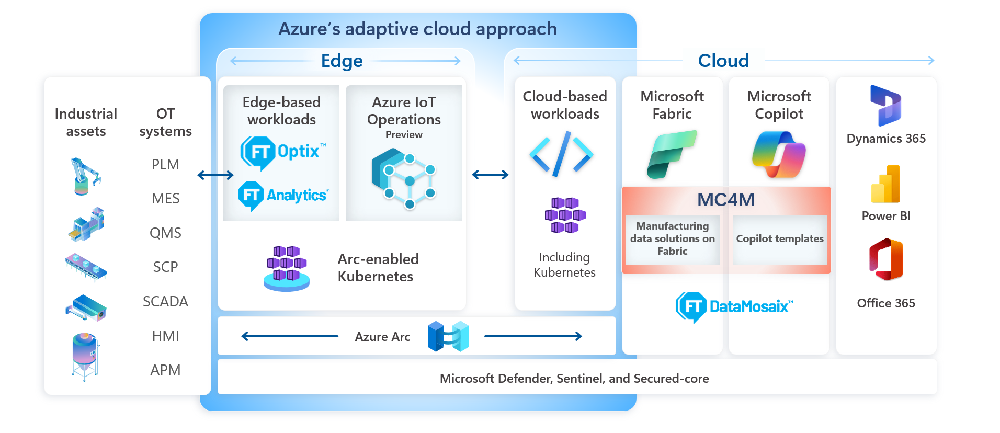
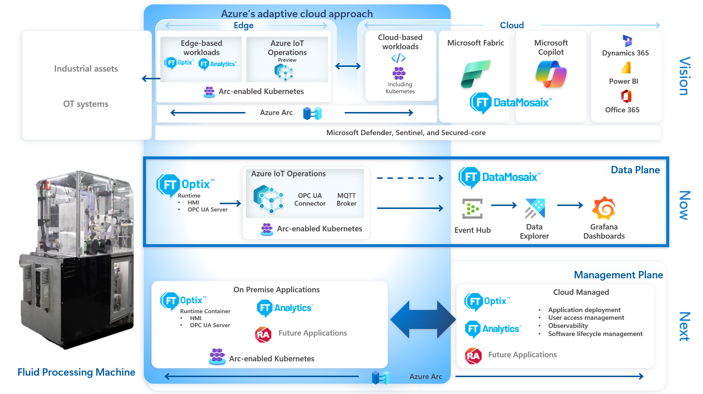
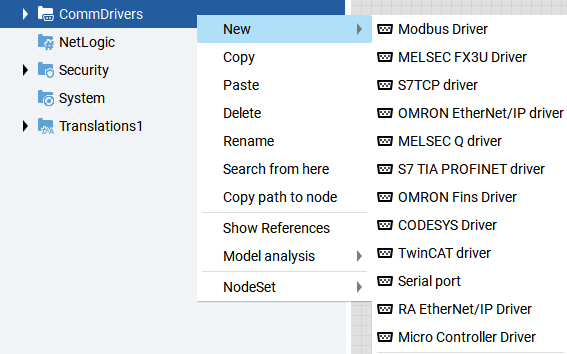
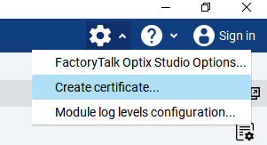
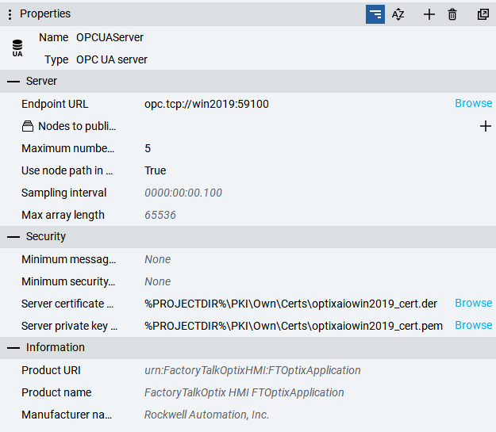
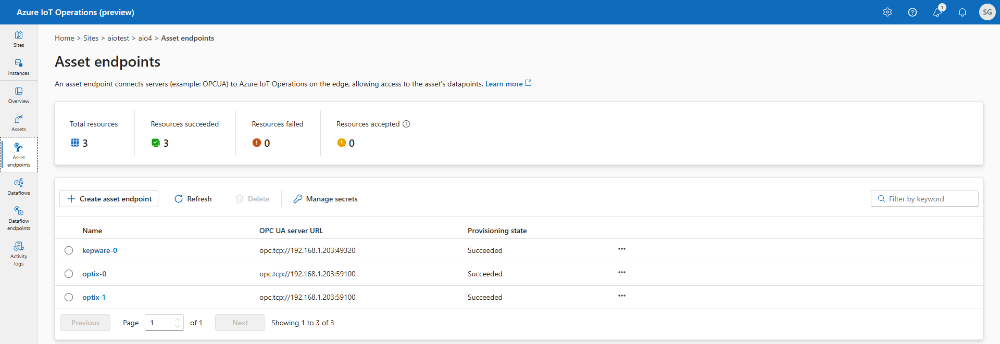
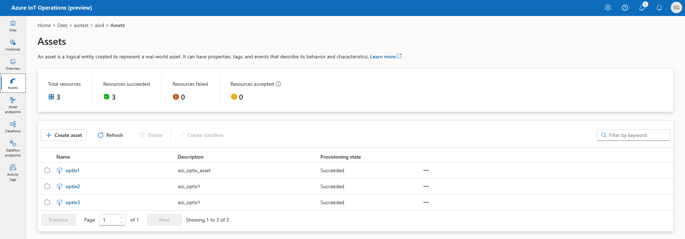
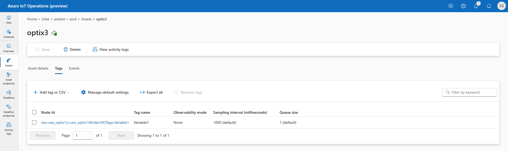

FactoryTalk Optix and Azure IoT Operations Integration
====

- [Summary](#summary)
- [Architecture](#architecture)
- [Installation](#installation)
  - [FactoryTalk Optix](#factorytalk-optix)
  - [Azure IoT Operations](#azure-iot-operations)
- [Configuration](#configuration)
  - [FactoryTalk Optix](#factorytalk-optix-1)
  - [Azure IoT Operations](#azure-iot-operations-1)
- [Appendix A - Automate Azure IoT Operations Install](#appendix-a---automate-azure-iot-operations-install)

## Revisions

|   Version | Date        | Author        | Changes Made                                              |
|-----------|-------------|---------------|-----------------------------------------------------------|
|       1.0   | 12 Nov 2024 | Salma Ghafoor | Initial creation of the document                         |

## Summary

This getting started guide outlines the integration of FactoryTalk®️ Optix™️ and Azure IoT Operations, tested on a fluid processing demo machine co-developed by Rockwell Automation and Microsoft.

It covers the architecture, installation, and configuration steps necessary for the integration. The architecture section includes a diagram illustrating the adaptive cloud approach, data plane, and management plane. The installation section provides detailed steps for setting up FactoryTalk Optix and Azure IoT Operations, including a shell script for automating the process. The configuration section explains how to set up FactoryTalk Optix and Azure IoT Operations, including creating applications, configuring OPC UA servers, and generating certificates.

## Architecture

The adaptive cloud approach that is being adopted by Rockwell Automation and Microsoft is depicted in the diagram below.

The diagram below shows how FactoryTalk Optix and Azure IoT Operations integration can be achieved based on the fluid processing demo machine co-developed by Rockwell Automation and Microsoft. This integration can be applied to any other scenario that requires infrastructure for data transfer and edge management.

The diagram is divided into three sections: the top section shows the vision for the adaptive cloud approach, the second section shows what has been achieved on the data plane with a working proof of concept, and the third section shows what can be achieved with the management plane.

## Installation

### FactoryTalk Optix

Install FactoryTalk Optix Studio and FactoryTalk Optix Runtime from [FactoryTalk Hub](https://home.cloud.rockwellautomation.com/).

### Azure IoT Operations

Install a Kubernetes cluster and Azure IoT Operations using instructions in [Deployment overview - Azure IoT Operations Preview | Microsoft Learn](https://learn.microsoft.com/en-us/azure/iot-operations/deploy-iot-ops/overview-deploy).

> [!NOTE]
> This quick start guide was developed and tested on an Ubuntu machine; however, it should also work with a Windows machine.

Alternatively see [Appendix A - Automate Azure IoT Operations Install](#appendix-a---automate-azure-iot-operations-install) for a shell script that will automatically install a Kubernetes cluster and deploy Azure IoT Operations to it. 

> [!CAUTION]
> The script was built and tested against the Preview version and will need adapting to work with the official release.

## Configuration

### FactoryTalk Optix

The sample FactoryTalk Optix Application in this repository contains the key components required to publish data from a control system to Azure IoT Operations. The sample application contains:
* A sample PLC program for Allen-Bradley L8 ControlLogix
* Ethernet/IP Communication Driver
* Application certificate
* OPC UA Server
* Graphical User Interface
    * Read data from PLC
    * Manual tag write (for when no PLC is connected)

> [!NOTE] 
> The application certificate used by the application will need to be regenerated to match your computer name.

Alternatively, follow the steps outlined below to manually create a FactoryTalk Optix application that contains OPC UA data and make it available as an OPC UA Server for use with Azure IoT Operations. 

- Use FactoryTalk Optix Studio to create a FactoryTalk Optix application.
- Add Communication Driver(s) to read control system data.
    - Use the *RAEtherNet/IP Driver* to connect to a Rockwell Automation controller.
    - OPC UA is supported through the OPC UA object.

  

- (Optional) Visualise the control system data on a graphical screen.

- Use the *Settings* → *Create certificate* menu to create an application certificate for the FactoryTalk Optix server. This certificate will be used to authenticate the Optix OPC UA Server with Azure IoT Operations.

  

- In the project folder pane, add an OPC UA Server.
  - Set the *Server certificate file* and *Server private key file* properties to use the FactortyTalk Optix certificate.
  -  Use the *Nodes to publish* property to create a Configuration to publish a subset of nodes or leave blank to publish all nodes.
  - Set the *Endpoint URL* property to use computer name or IP address so that it is accessible from the AIO box.
  -  Set the *Use node path in NodeIds* property to *True* to use fully qualified tag names when configuring tags in AIO. Setting this to true will ensure the OPC UA tag names use the user-friendly format of *ns=\<namespace>;s=Path.To.Node* instead of having to specify the node id guid.

  

- Import the AIO certificates into the project trusted store using the instructions in the FactoryTalk Optix Studio Help.

## Azure IoT Operations

- Import the FactoryTalk Optix certificate into the trusted store using instructions in [Configure OPC UA certificates - Azure IoT Operations Preview | Microsoft Learn](https://learn.microsoft.com/en-us/azure/iot-operations/discover-manage-assets/howto-configure-opcua-certificates-infrastructure?tabs=bash).
- Open the [Operations Experience](https://iotoperations.azure.com/) site to configure assets and data flow.
- In the *Asset endpoints* page create an asset endpoint profile to point to the FactoryTalk Optix OPC UA Server.

  

- In the *Assets* page create an asset that uses the endpoint profile and then configure the tag list.

  
  

 

  > [!TIP]
  >The node address for OPC UA tags can be seen in FactoryTalk Optix Studio. Alternatively, you can use an OPC UA client such as UAExpert to browse the FactoryTalk Optix OPC UA Server to get the address configuration for the tags. A tag's node id should use the format:
  >~~~
  >nsu=<Optix_Application_Name>;s=Path.To.Node
  >~~~
  >e.g. where the Optix application is named aio_optix1 and a tag named Variable1 has been created in folder named AIOTags, which is a child of the Model folder:
  >~~~
  >nsu=aio_optix1;s=aio_optix1.Model.AIOTags.Variable1
  >~~~

## Appendix A - Automate Azure IoT Operations Install

The [setupaio.sh](setupaio.sh "setupaio.sh") shell script automates the installation of a Kubernetes cluster and deploys an instance of Azure IoT Operations to the cluster.

Assumptions:

- The script will create a single-node cluster.
- The script will use a specified user account for access.

> [!NOTE]
>The script was built and tested against the Preview version and may need adapting for later releases. This script is provided as-is with no warranty or support and it is the user's responsibility to test and validate before implementing in a production environment.

Copy the code into a file and name it setupaio.sh

> [!CAUTION]
> The file should be generated directly on the Ubuntu box to avoid format errors with the line ending characters.

~~~bash
#!/bin/bash

# Function to display help
show_help() {
  echo "Usage: $0 -l LOCATION -g RESOURCE_GROUP -c CLUSTER_NAME -u USER_EMAIL [-k KEYVAULT_NAME] [-i SECRETS_IDENTITY] [-m COMPONENTS_IDENTITY] [-a STORAGE_ACCOUNT] [-r SCHEMA_REGISTRY_NAME] [-n REGISTRY_NAMESPACE] [-o INSTANCE_NAME]"
  echo "  -l LOCATION            Azure location (mandatory)"
  echo "  -g RESOURCE_GROUP      Azure resource group (mandatory)"
  echo "  -c CLUSTER_NAME        Cluster name (mandatory)"
  echo "  -u USER_EMAIL          User email for role assignment (mandatory)"
  echo "  -k KEYVAULT_NAME       Key Vault name (optional, defaults to CLUSTER_NAME + '-kv')"
  echo "  -i SECRETS_IDENTITY    Azure Managed Identity for secrets (optional, defaults to CLUSTER_NAME + '_sid')"
  echo "  -m COMPONENTS_IDENTITY Azure Managed Identity for components (optional, defaults to CLUSTER_NAME + '_cid')"
  echo "  -a STORAGE_ACCOUNT     Storage account name (optional, defaults to CLUSTER_NAME + 'storage')"
  echo "  -r SCHEMA_REGISTRY_NAME IoT Operations Schema Registry name (optional, defaults to CLUSTER_NAME + 'reg')"
  echo "  -n REGISTRY_NAMESPACE  IoT Operations Registry namespace (optional, defaults to CLUSTER_NAME + 'regns')"
  echo "  -o INSTANCE_NAME       IoT Operations instance name (optional, defaults to CLUSTER_NAME + '-inst')"
  exit 1
}

# Function to handle SIGINT signal
cleanup() {
  echo "Script cancelled by user."
  exit 0
}

# Set trap to call cleanup function on SIGINT
trap cleanup SIGINT

# Enable exit on error
set -e

# Initialize default values
KEYVAULT_NAME=""
SECRETS_IDENTITY=""
COMPONENTS_IDENTITY=""
STORAGE_ACCOUNT=""
SCHEMA_REGISTRY_NAME=""
REGISTRY_NAMESPACE=""
INSTANCE_NAME=""

# Parsing input parameters
while getopts "l:g:c:u:k:i:m:a:r:n:o:h" opt; do
  case "$opt" in
    l) LOCATION=$OPTARG ;;
    g) RESOURCE_GROUP=$OPTARG ;;
    c) CLUSTER_NAME=$OPTARG ;;
    u) USER_EMAIL=$OPTARG ;;
    k) KEYVAULT_NAME=$OPTARG ;;
    i) SECRETS_IDENTITY=$OPTARG ;;
    m) COMPONENTS_IDENTITY=$OPTARG ;;
    a) STORAGE_ACCOUNT=$OPTARG ;;
    r) SCHEMA_REGISTRY_NAME=$OPTARG ;;
    n) REGISTRY_NAMESPACE=$OPTARG ;;
    o) INSTANCE_NAME=$OPTARG ;;
    h) show_help ;;
    *) show_help ;;
  esac
done

# Check for empty or unset parameters and assign default values
if [ -z "$KEYVAULT_NAME" ]; then
  KEYVAULT_NAME=${CLUSTER_NAME}-kv
fi

if [ -z "$SECRETS_IDENTITY" ]; then
  SECRETS_IDENTITY=${CLUSTER_NAME}_sid
fi

if [ -z "$COMPONENTS_IDENTITY" ]; then
  COMPONENTS_IDENTITY=${CLUSTER_NAME}_cid
fi

if [ -z "$STORAGE_ACCOUNT" ]; then
  STORAGE_ACCOUNT=${CLUSTER_NAME}storage
fi

if [ -z "$SCHEMA_REGISTRY_NAME" ]; then
  SCHEMA_REGISTRY_NAME=${CLUSTER_NAME}reg
fi

if [ -z "$REGISTRY_NAMESPACE" ]; then
  REGISTRY_NAMESPACE=${CLUSTER_NAME}regns
fi

if [ -z "$INSTANCE_NAME" ]; then
  INSTANCE_NAME=${CLUSTER_NAME}-inst
fi

# Show the values for all input parameters
echo "Input Parameter Values:"
echo "LOCATION: $LOCATION"
echo "RESOURCE_GROUP: $RESOURCE_GROUP"
echo "CLUSTER_NAME: $CLUSTER_NAME"
echo "USER_EMAIL: $USER_EMAIL"
echo "KEYVAULT_NAME: $KEYVAULT_NAME"
echo "SECRETS_IDENTITY: $SECRETS_IDENTITY"
echo "COMPONENTS_IDENTITY: $COMPONENTS_IDENTITY"
echo "STORAGE_ACCOUNT: $STORAGE_ACCOUNT"
echo "SCHEMA_REGISTRY_NAME: $SCHEMA_REGISTRY_NAME"
echo "REGISTRY_NAMESPACE: $REGISTRY_NAMESPACE"
echo "INSTANCE_NAME: $INSTANCE_NAME"

# Validate mandatory input parameters
if [ -z "$LOCATION" ] || [ -z "$RESOURCE_GROUP" ] || [ -z "$CLUSTER_NAME" ] || [ -z "$USER_EMAIL" ]; then
  echo "Missing mandatory input parameter. Please provide values for -l, -g, -c, and -u options."
  show_help
fi

#Ensure curl is installed
if ! command -v curl &> /dev/null; then
  echo "curl not found. Installing..."
  echo "You may be prompted for your sudo password."
  sudo apt update && sudo apt install -y curl
fi

#Ensure the Azure CLI is installed
if ! command -v az &> /dev/null; then
  echo "Azure CLI not found. Installing..."
  echo "You may be prompted for your sudo password."
  curl -sL https://aka.ms/InstallAzureCLIDeb | sudo bash
else
  echo "Azure CLI is already installed."
fi

#Install required Azure CLI extensions
echo "Installing required Azure CLI extensions..."
az extension add --upgrade --name azure-iot-ops
az extension add --upgrade --name connectedk8s

#Login to Azure and capture the subscription ID
echo "Logging into Azure and capturing the subscription ID..."
echo "You need to log in to Azure using the web browser window that may have opened in the background."
az login --output none
SUBSCRIPTION_ID=$(az account show --query id --output tsv)

#Install k3s
if ! command -v k3s &> /dev/null; then
  echo "k3s not found. Installing k3s..."
  curl -sfL https://get.k3s.io | sh -
  kubectl version --client
else
  echo "k3s is already installed."
fi

#Install Helm
if ! command -v helm &> /dev/null; then
  echo "Helm not found. Installing Helm..."
  curl -fsSL -o get_helm.sh https://raw.githubusercontent.com/helm/helm/main/scripts/get-helm-3
  chmod 700 get_helm.sh
  ./get_helm.sh
else
  echo "Helm is already installed."
fi

echo "Configuring k3s cluster..."
#Configure k3s cluster
mkdir -p ~/.kube
sudo KUBECONFIG=~/.kube/config:/etc/rancher/k3s/k3s.yaml kubectl config view --flatten > ~/.kube/merged
mv ~/.kube/merged ~/.kube/config
chmod 0600 ~/.kube/config
export KUBECONFIG=~/.kube/config

if ! kubectl config use-context default &> /dev/null; then
  echo "Default context not found, setting a new context."
  kubectl config set-context default
else
  kubectl config use-context default
fi

sudo chmod 644 /etc/rancher/k3s/k3s.yaml

echo "Updating sysctl parameters..."
echo fs.inotify.max_user_instances=8192 | sudo tee -a /etc/sysctl.conf
echo fs.inotify.max_user_watches=524288 | sudo tee -a /etc/sysctl.conf
echo fs.file-max=100000 | sudo tee -a /etc/sysctl.conf
sudo sysctl -p

#Check if resource group exists
echo "Checking if resource group $RESOURCE_GROUP exists..."
if az group show --name "$RESOURCE_GROUP" --subscription "$SUBSCRIPTION_ID" &> /dev/null; then
  echo "Resource group $RESOURCE_GROUP already exists."
else
  echo "Creating resource group $RESOURCE_GROUP..."
  az group create --location "$LOCATION" --resource-group "$RESOURCE_GROUP" --subscription "$SUBSCRIPTION_ID"
fi

echo "Registering required Azure providers..."
#Register providers if not already registered
for provider in Microsoft.ExtendedLocation Microsoft.Kubernetes Microsoft.KubernetesConfiguration Microsoft.IoTOperations Microsoft.DeviceRegistry Microsoft.SecretSyncController; do
  if ! az provider show --namespace "$provider" --query "registrationState" --output tsv | grep -q "Registered"; then
    az provider register -n "$provider"
  else
    echo "Provider $provider is already registered."
  fi
done

#Connect k8s cluster to Azure
echo "Connecting k8s cluster $CLUSTER_NAME to Azure..."
if ! az connectedk8s show --resource-group "$RESOURCE_GROUP" --name "$CLUSTER_NAME" &> /dev/null; then
  az connectedk8s connect --name "$CLUSTER_NAME" -l "$LOCATION" --resource-group "$RESOURCE_GROUP" --subscription "$SUBSCRIPTION_ID" --enable-oidc-issuer --enable-workload-identity
fi

echo "Configuring OIDC..."
OIDC_URL=$(az connectedk8s show --resource-group "$RESOURCE_GROUP" --name "$CLUSTER_NAME" --query oidcIssuerProfile.issuerUrl --output tsv)

if ! sudo grep -q "service-account-issuer=$OIDC_URL" /etc/rancher/k3s/config.yaml; then
  sudo sh -c "echo -e 'kube-apiserver-arg:\n - service-account-issuer=$OIDC_URL\n - service-account-max-token-expiration=24h' >> /etc/rancher/k3s/config.yaml"
fi

echo "Enabling custom locations..."
if ! az connectedk8s feature list --name "$CLUSTER_NAME" -g "$RESOURCE_GROUP" --query "features[].name" -o tsv | grep -q "custom-locations"; then
  OBJECT_ID=$(az ad sp show --id bc313c14-388c-4e7d-a58e-70017303ee3b --query id -o tsv)
  echo "OBJECT_ID= " $OBJECT_ID  
  az connectedk8s enable-features -n "$CLUSTER_NAME" -g "$RESOURCE_GROUP" --custom-locations-oid "$OBJECT_ID" --features cluster-connect custom-locations
  sudo systemctl restart k3s
  az iot ops verify-host
fi

kubectl get deployments,pods -n azure-arc

echo "Deploying AIO..."
#Deploy AIO
if ! az keyvault show --name "$KEYVAULT_NAME" --resource-group "$RESOURCE_GROUP" &> /dev/null; then
  az keyvault create --enable-rbac-authorization --name "$KEYVAULT_NAME" --resource-group "$RESOURCE_GROUP"
fi

if ! az role assignment list --scope "/subscriptions/${SUBSCRIPTION_ID}/resourceGroups/${RESOURCE_GROUP}" --assignee "$USER_EMAIL" --query "[].roleDefinitionName" -o tsv | grep -q "Role Based Access Control Administrator"; then
  az role assignment create --assignee "$USER_EMAIL" --role "Role Based Access Control Administrator" --scope "/subscriptions/${SUBSCRIPTION_ID}/resourceGroups/${RESOURCE_GROUP}"
fi

if ! az role assignment list --scope "/subscriptions/${SUBSCRIPTION_ID}/resourceGroups/${RESOURCE_GROUP}/providers/Microsoft.KeyVault/vaults/$KEYVAULT_NAME" --assignee "$USER_EMAIL" --query "[].roleDefinitionName" -o tsv | grep -q "Key Vault Secrets Officer"; then
  az role assignment create --assignee "$USER_EMAIL" --role "Key Vault Secrets Officer" --scope "/subscriptions/${SUBSCRIPTION_ID}/resourceGroups/${RESOURCE_GROUP}/providers/Microsoft.KeyVault/vaults/$KEYVAULT_NAME"
fi

if ! az storage account show --name "$STORAGE_ACCOUNT" --resource-group "$RESOURCE_GROUP" &> /dev/null; then
  az storage account create --name "$STORAGE_ACCOUNT" --resource-group "$RESOURCE_GROUP" --enable-hierarchical-namespace
fi

if ! az iot ops schema registry list --resource-group "$RESOURCE_GROUP" --query "name" -o tsv | grep -q "$SCHEMA_REGISTRY_NAME"; then
  az iot ops schema registry create --name "$SCHEMA_REGISTRY_NAME" --resource-group "$RESOURCE_GROUP" --registry-namespace "$REGISTRY_NAMESPACE" --sa-resource-id "$(az storage account show --name "$STORAGE_ACCOUNT" --resource-group "$RESOURCE_GROUP" -o tsv --query id)"
fi

echo "Pausing 30 seconds before creating role assignments on new storage account"
sleep 30

#if ! az role assignment list --scope "/subscriptions/${SUBSCRIPTION_ID}/resourceGroups/${RESOURCE_GROUP}/providers/Microsoft.Storage/storageAccounts/$STORAGE_ACCOUNT" --assignee "$SCHEMA_REGISTRY_NAME" --query "[].roleDefinitionName" -o tsv | grep -q "Storage Blob Data Contributor"; then
  SCHEMA_REGISTRY_RESOURCE_ID=$(az resource show --resource-group "$RESOURCE_GROUP" --name $SCHEMA_REGISTRY_NAME --resource-type "microsoft.deviceregistry/schemaregistries" --query id --output tsv)
  echo $SCHEMA_REGISTRY_RESOURCE_ID
  SCHEMA_REGISTRY_PRINCIPAL_ID=$(az resource show --ids "$SCHEMA_REGISTRY_RESOURCE_ID" --query "identity.principalId" --output tsv)
  echo $SCHEMA_REGISTRY_PRINCIPAL_ID
  az role assignment create --assignee "$SCHEMA_REGISTRY_PRINCIPAL_ID" --role "Storage Blob Data Contributor" --scope "/subscriptions/${SUBSCRIPTION_ID}/resourceGroups/${RESOURCE_GROUP}/providers/Microsoft.Storage/storageAccounts/$STORAGE_ACCOUNT/blobServices/default/containers/schemas"
#fi

if ! az iot ops instance show --name "$INSTANCE_NAME" --resource-group "$RESOURCE_GROUP" &> /dev/null; then
  az iot ops init --cluster "$CLUSTER_NAME" --resource-group "$RESOURCE_GROUP" 
  az iot ops create --name "$INSTANCE_NAME" --cluster "$CLUSTER_NAME" --resource-group "$RESOURCE_GROUP" --sr-resource-id "/subscriptions/${SUBSCRIPTION_ID}/resourceGroups/${RESOURCE_GROUP}/providers/Microsoft.DeviceRegistry/schemaRegistries/$SCHEMA_REGISTRY_NAME"
fi

echo "Securing configuration..."
#Secure configuration
if ! az identity show --name "$SECRETS_IDENTITY" --resource-group "$RESOURCE_GROUP" &> /dev/null; then
  az identity create --name "$SECRETS_IDENTITY" --resource-group "$RESOURCE_GROUP" --location "$LOCATION" --subscription "$SUBSCRIPTION_ID"
fi

if ! az identity show --name "$COMPONENTS_IDENTITY" --resource-group "$RESOURCE_GROUP" &> /dev/null; then
  az identity create --name "$COMPONENTS_IDENTITY" --resource-group "$RESOURCE_GROUP" --location "$LOCATION" --subscription "$SUBSCRIPTION_ID"
fi

UA_SECRETS_MI_RESOURCE_ID="/subscriptions/${SUBSCRIPTION_ID}/resourcegroups/${RESOURCE_GROUP}/providers/Microsoft.ManagedIdentity/userAssignedIdentities/$SECRETS_IDENTITY"
UA_COMPONENTS_MI_RESOURCE_ID="/subscriptions/${SUBSCRIPTION_ID}/resourcegroups/${RESOURCE_GROUP}/providers/Microsoft.ManagedIdentity/userAssignedIdentities/$COMPONENTS_IDENTITY"
KEYVAULT_RESOURCE_ID="/subscriptions/${SUBSCRIPTION_ID}/resourceGroups/${RESOURCE_GROUP}/providers/Microsoft.KeyVault/vaults/$KEYVAULT_NAME"

if ! az iot ops secretsync show --name "$INSTANCE_NAME" --resource-group "$RESOURCE_GROUP" &> /dev/null; then
  az iot ops secretsync enable --name "$INSTANCE_NAME" -g "$RESOURCE_GROUP" --mi-user-assigned "$UA_SECRETS_MI_RESOURCE_ID" --kv-resource-id "$KEYVAULT_RESOURCE_ID"
fi

az iot ops identity assign --name "$INSTANCE_NAME" --resource-group "$RESOURCE_GROUP" --mi-user-assigned "$UA_COMPONENTS_MI_RESOURCE_ID"

kubectl get pods -n azure-iot-operations
az iot ops check

echo "Script execution completed."
~~~

**Use the following command to execute the script and pass in the mandatory parameters:**

~~~bash
bash setupaio.sh -l <your_location> -g <your_resource_group> -c <your_cluster_name> -u <your_user_email>
~~~

Re-run the script if an error is encountered during script execution. Sometimes an error can occur when an object is newly created and immediately referenced, therefore rerunning the script will address this. However you must take note of any errors and address them with a resolution to ensure the environment is set up correctly.
