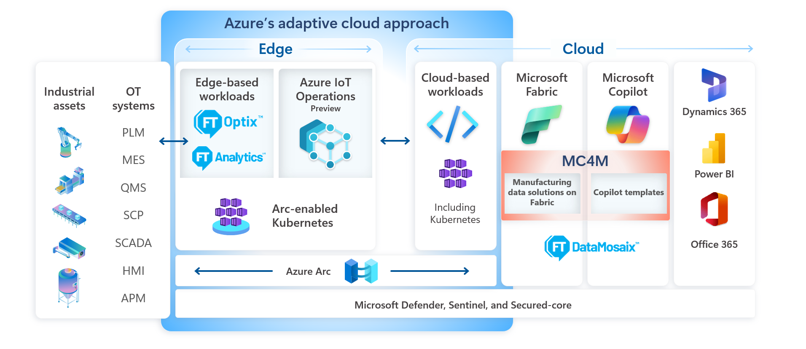
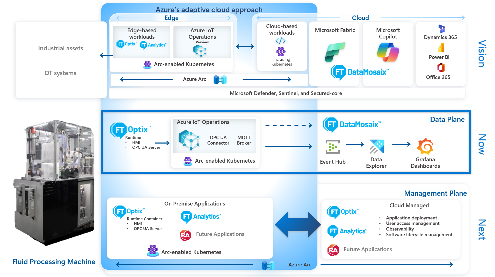
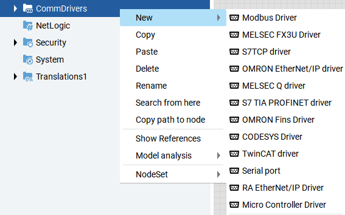
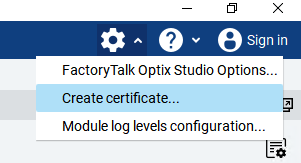
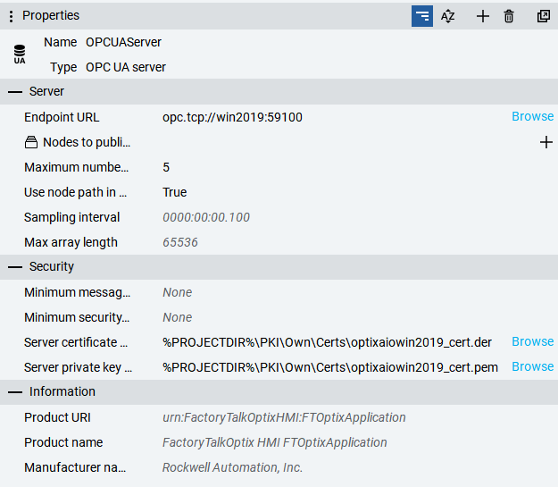
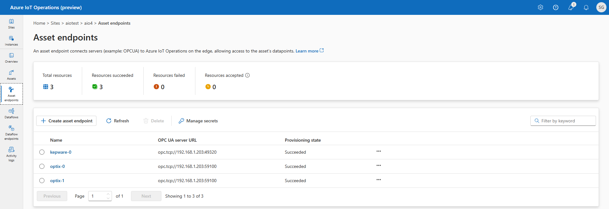
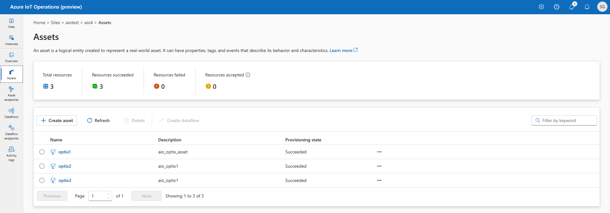
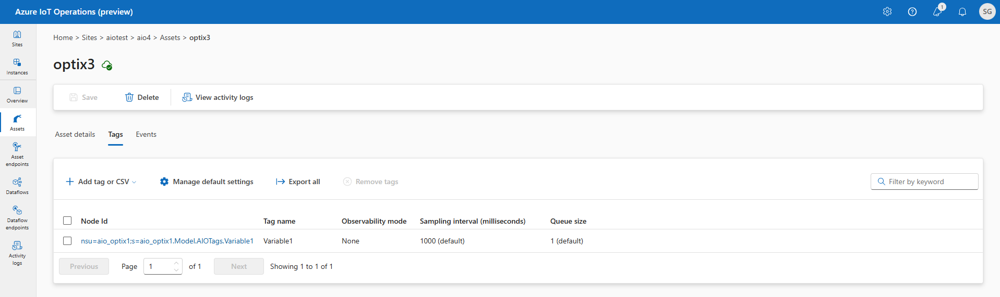

FactoryTalk Optix and Azure IoT Operations Integration
====

- [Summary](#summary)
- [Architecture](#architecture)
- [Installation](#installation)
  - [FactoryTalk Optix](#factorytalk-optix)
  - [Azure IoT Operations](#azure-iot-operations)
- [Configuration](#configuration)
  - [FactoryTalk Optix](#factorytalk-optix-1)
  - [Azure IoT Operations](#azure-iot-operations-1)
- [Appendix A - Automate Azure IoT Operations Install](#appendix-a---automate-azure-iot-operations-install)

## Revisions

|   Version | Date        | Author        | Changes Made                                              |
|-----------|-------------|---------------|-----------------------------------------------------------|
|       1.0   | 12 Nov 2024 | Salma Ghafoor | Initial creation of the document                         |
|       1.1   | 14 Nov 2025 | Salma Ghafoor | Updated Optix version                           |

## Summary

This getting started guide outlines the integration of FactoryTalk®️ Optix™️ and Azure IoT Operations, tested on a fluid processing demo machine co-developed by Rockwell Automation and Microsoft.

It covers the architecture, installation, and configuration steps necessary for the integration. The architecture section includes a diagram illustrating the adaptive cloud approach, data plane, and management plane. The installation section provides detailed steps for setting up FactoryTalk Optix and Azure IoT Operations. The configuration section explains how to set up FactoryTalk Optix and Azure IoT Operations, including creating applications, configuring OPC UA servers, and generating certificates.

## Architecture

The adaptive cloud approach that is being adopted by Rockwell Automation and Microsoft is depicted in the diagram below.

The diagram below shows how FactoryTalk Optix and Azure IoT Operations integration can be achieved based on the fluid processing demo machine co-developed by Rockwell Automation and Microsoft. This integration can be applied to any other scenario that requires infrastructure for data transfer and edge management.

The diagram is divided into three sections: the top section shows the vision for the adaptive cloud approach, the second section shows what has been achieved on the data plane with a working proof of concept, and the third section shows what can be achieved with the management plane.

## Installation

### FactoryTalk Optix

Install FactoryTalk Optix Studio and FactoryTalk Optix Runtime from [FactoryTalk Hub](https://home.cloud.rockwellautomation.com/).

### Azure IoT Operations

Install a Kubernetes cluster and Azure IoT Operations using instructions in [Deployment overview - Azure IoT Operations Preview | Microsoft Learn](https://learn.microsoft.com/en-us/azure/iot-operations/deploy-iot-ops/overview-deploy).

> [!NOTE]
> This quick start guide was developed and tested on an Ubuntu machine; however, it should also work with a Windows machine.

## Configuration

### FactoryTalk Optix

The sample FactoryTalk Optix Application in this repository contains the key components required to publish data from a control system to Azure IoT Operations. The sample application contains:
* A sample PLC program for Allen-Bradley L8 ControlLogix
* Ethernet/IP Communication Driver
* Application certificate
* OPC UA Server
* Graphical User Interface
    * Read data from PLC
    * Manual tag write (for when no PLC is connected)

> [!NOTE] 
> The application certificate used by the application will need to be regenerated to match your computer name.

Alternatively, follow the steps outlined below to manually create a FactoryTalk Optix application that contains OPC UA data and make it available as an OPC UA Server for use with Azure IoT Operations. 

- Use FactoryTalk Optix Studio to create a FactoryTalk Optix application.
- Add Communication Driver(s) to read control system data.
    - Use the *RAEtherNet/IP Driver* to connect to a Rockwell Automation controller.
    - OPC UA is supported through the OPC UA object.

  

- (Optional) Visualise the control system data on a graphical screen.

- Use the *Settings* → *Create certificate* menu to create an application certificate for the FactoryTalk Optix server. This certificate will be used to authenticate the Optix OPC UA Server with Azure IoT Operations.

  

- In the project folder pane, add an OPC UA Server.
  - Set the *Server certificate file* and *Server private key file* properties to use the FactortyTalk Optix certificate.
  -  Use the *Nodes to publish* property to create a Configuration to publish a subset of nodes or leave blank to publish all nodes.
  - Set the *Endpoint URL* property to use computer name or IP address so that it is accessible from the AIO box.
  -  Set the *Use node path in NodeIds* property to *True* to use fully qualified tag names when configuring tags in AIO. Setting this to true will ensure the OPC UA tag names use the user-friendly format of *ns=\<namespace>;s=Path.To.Node* instead of having to specify the node id guid.

  

- Import the AIO certificates into the project trusted store using the instructions in the FactoryTalk Optix Studio Help.

## Azure IoT Operations

- Import the FactoryTalk Optix certificate into the trusted store using instructions in [Configure OPC UA certificates - Azure IoT Operations Preview | Microsoft Learn](https://learn.microsoft.com/en-us/azure/iot-operations/discover-manage-assets/howto-configure-opcua-certificates-infrastructure?tabs=bash).
- Open the [Operations Experience](https://iotoperations.azure.com/) site to configure assets and data flow.
- In the *Asset endpoints* page create an asset endpoint profile to point to the FactoryTalk Optix OPC UA Server.

  

- In the *Assets* page create an asset that uses the endpoint profile and then configure the tag list.

  
  

 

  > [!TIP]
  >The node address for OPC UA tags can be seen in FactoryTalk Optix Studio. Alternatively, you can use an OPC UA client such as UAExpert to browse the FactoryTalk Optix OPC UA Server to get the address configuration for the tags. A tag's node id should use the format:
  >~~~
  >nsu=<Optix_Application_Name>;s=Path.To.Node
  >~~~
  >e.g. where the Optix application is named aio_optix1 and a tag named Variable1 has been created in folder named AIOTags, which is a child of the Model folder:
  >~~~
  >nsu=aio_optix1;s=aio_optix1.Model.AIOTags.Variable1
  >~~~

